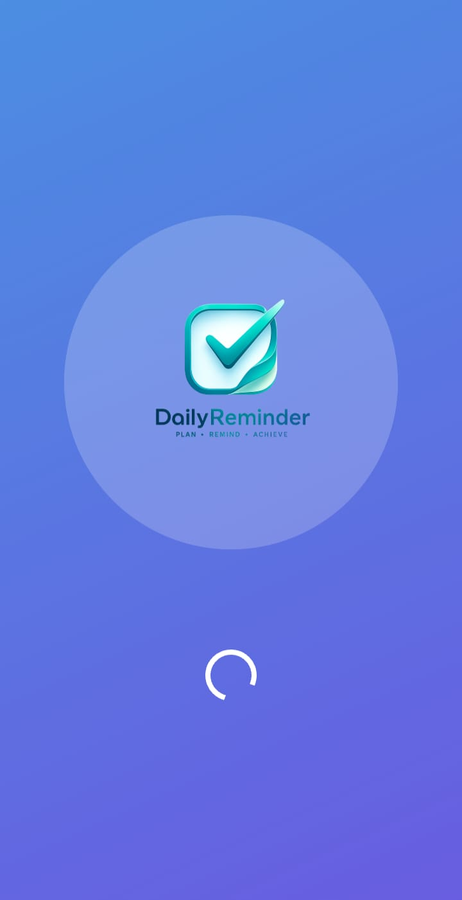
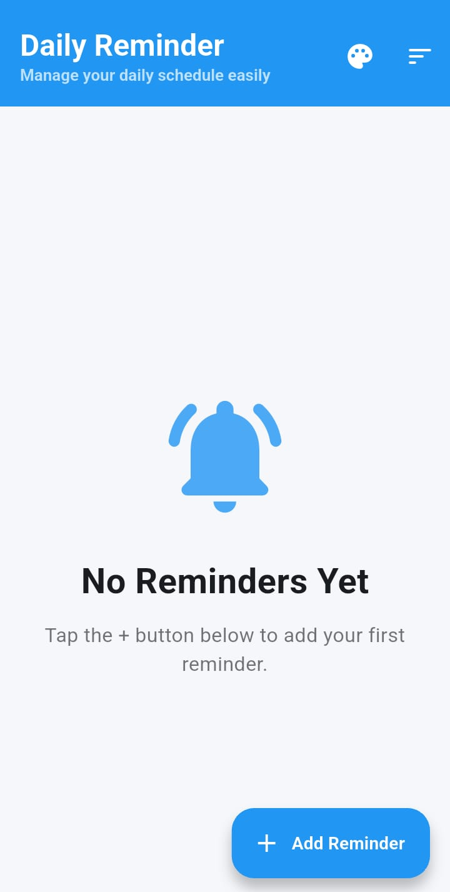
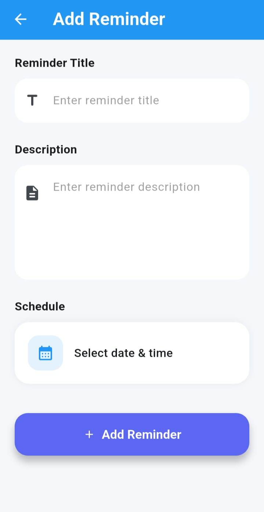
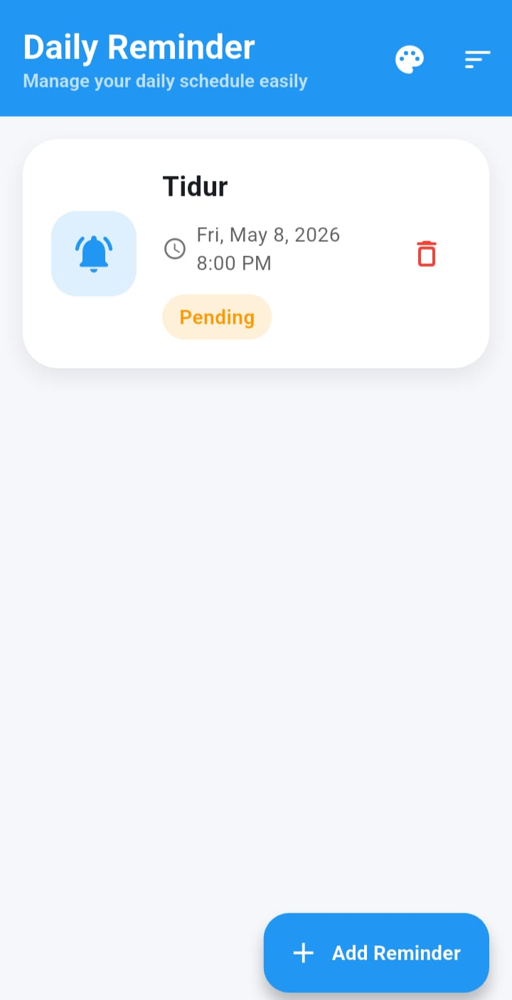

# 🧠 Daily Reminder App

A modern and elegant Flutter reminder application designed to help users manage schedules and receive timely notifications.

Built with ❤️ using Flutter, Firebase Firestore, and Local Notifications.

---

# ✨ Features

✅ Add, edit, and delete reminders  
✅ Local notifications (15, 10, 5 minutes & exact time)  
✅ Firebase Firestore integration  
✅ Beautiful modern UI  
✅ Splash screen with custom branding  
✅ Reminder status system  
✅ Sort reminders  
✅ Mark reminders as completed  
✅ Offline-friendly architecture  
✅ Theme customization  
✅ Responsive design  

---

# 📱 Screenshots









---

# 🛠️ Technologies Used

- Flutter
- Firebase Firestore
- Provider
- flutter_local_notifications
- Shared Preferences
- Firebase Core
- Intl
- Material 3 Design

---

# 🚀 Getting Started

## Clone Repository

```bash
git clone https://github.com/YOUR_USERNAME/daily-reminder-app.git
```

## Install Dependencies

```bash
flutter pub get
```

## Run App

```bash
flutter run
```

---

# 🔥 Firebase Setup

Add your Firebase configuration files:

- google-services.json
- firebase_options.dart

Enable:
- Firestore Database
- Firebase Authentication (optional)

---

# 📂 Project Structure

```text
lib/
├── models/
├── providers/
├── screens/
├── services/
├── theme/
├── main.dart
```

# 📄 License

This project is for educational purposes.

---

# ⭐ Final Project

This application was developed as a Flutter prototype project with modern UI/UX design and Firebase integration.
